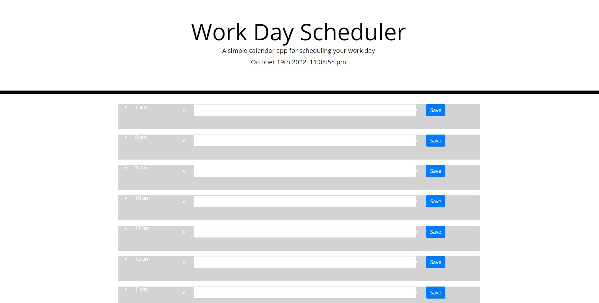

# Daily Planner
> A planner that allows you to add an event during each hour of the day.
> Live demo [_here_](https://ralakash.github.io/ProjectFive/).

## Table of Contents
* [General Info](#general-information)
* [Features](#features)
* [Screenshots](#screenshots)
* [Usage](#usage)
* [Project Status](#project-status)
* [Room for Improvement](#room-for-improvement)
* [Acknowledgements](#acknowledgements)

## General Information
- This planner saves a string to local storage and updates the color of the background based on the time of day.
- This is a super simple planner to help you keep track of your day.
- The purpose of this project is to help you stay ahead in your work
- I undertook this project to learn more about jquery and bootstrap and moment.js

## Features
List the ready features here:
- Saves data to local storage
- Tells you the time
- Changes color based on the time

## Screenshots

<!-- If you have screenshots you'd like to share, include them here. -->

## Usage
Load the webpage and type in the box

## Project Status
Project is:  _no longer being worked on_. The project meets the requirements for the project.

## Room for Improvement

Room for improvement:
- There is a bug if you use a comma in your event it will break the array. 
- The formating could be nicer.

## Acknowledgements
Give credit here.
- Thanks to my TA's and instructor who helped as well as my Tutor

